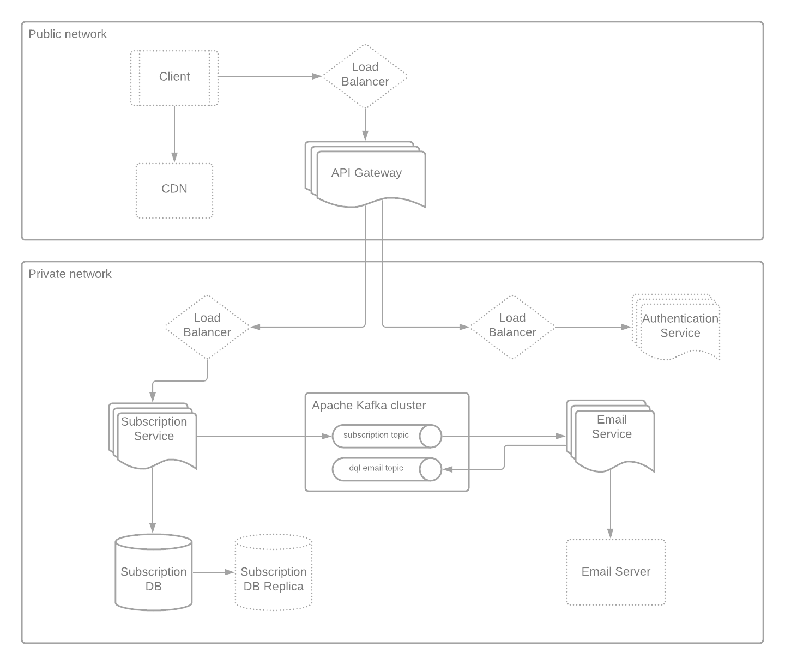
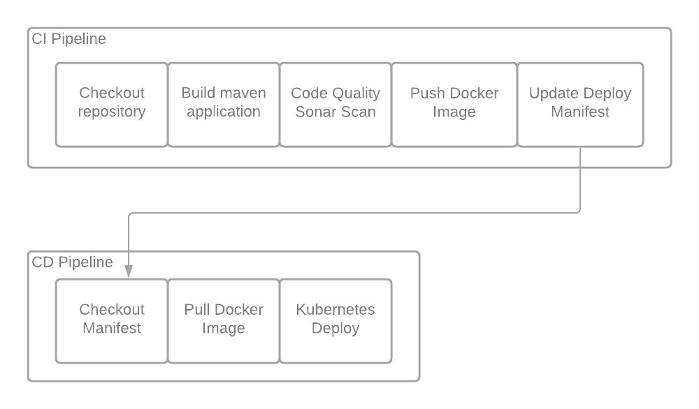

# Subscription System

System Design
-
The approach of this solution has followed an Event-Driven Architecture where each microservice has a single responsibility inside the business flow. 

Apache Kafka is a distributed stream platform scalable, fault tolerance and capable of handling messages with high-throughput and low-latency.
It is scalable by adding more partitions to our topics. This way, it is allowed to increase the number of consumers processing events and therefore scaling the solution. It is fault tolerance by adding more brokers into the Kafka Cluster and assuring through the replication factor that none of the messages sent will be lost.

Given the requirements, there are two main business responsibilities that can be split into microservices and decouple from each other by adding Kafka as an even communication platform:
- Subscription service: received a request of a new subscription and persist into a database
- Email Service: received a request of a new subscription and send an e-mail

In terms of persisting data, apparently there is only writings at this point and the schema is defined. Both SQL and NoSQL approach would fit in our solutions so we can think of a MySQL cluster, replicating nodes across data centers for disaster recovery in case of failure and sharding nodes for horizontal scaling without losing ACID features.

In the solution, it is also added an API gateway that works as an edge server routing all request and performing the authentication. Let's assume that there is an organizational authentication server that will be hit by the gateway filtering and authenticating every single request.

Let's take a look to the low level diagram where each component it is scalable: 



Building
-

Visit building section for each project and generate all artifacts independently
- [Email Service](email-service/README.md#Building)
- [Subscription Service API](subscription-internal-service/README.md#Building)
- [API Gateway](gateway-service/README.md#Building)

Running
-
#### Docker
```
docker-compose up -d
```

Playing around
-
Swagger UI: http://localhost:8081/swagger-ui.html

#### Request-response samples
Subscription successfully created:
```
curl -X POST "http://localhost:8080/api/subscription" -H "accept: application/json" -H "Content-Type: application/json" -H "Authorization: 1234567890" -d "{ \"consent\": true, \"dateOfBirth\": \"1983-08-15\", \"email\": \"my@email.com\", \"firstName\": \"Borja\", \"gender\": \"Prefer not to say\"}"
```
```json
{ 
  "id":"f58ad26a-aa18-4121-a363-9bda86989d57"
}
```
Access Denied error:
```
curl -X POST "http://localhost:8080/api/subscription" -H "accept: application/json" -H "Content-Type: application/json" -H -d "{ \"consent\": true, \"dateOfBirth\": \"1983-08-15\", \"email\": \"my@email.com\", \"firstName\": \"Borja\", \"gender\": \"Prefer not to say\"}"
```
```json
{ 
  "timestamp":"2020-09-26T18:41:41.334+0000","status":403,"error":"Forbidden","message":"Access Denied","path":"/api/subscription"
}
```
Validation error:
```
curl -X POST "http://localhost:8080/api/subscription" -H "accept: application/json" -H "Content-Type: application/json" -H "Authorization: 1234567890" -d "{ \"consent\": true, \"dateOfBirth\": \"1983-08-15\", \"email\": \"my@email.com\", \"firstName\": \"Borja\", \"gender\": \"Prefer not to say\"}"
```
```json
{
  "message":"SubscriptionDTO already exists for my@email.com"
}
```
Validation error:
```
curl -X POST "http://localhost:8080/api/subscription" -H "accept: application/json" -H "Content-Type: application/json" -H "Authorization: 1234567890" -d "{ \"consent\": false, \"dateOfBirth\": \"1983-08-15\", \"email\": \"ivanlidemail\", \"firstName\": \"Borja\", \"gender\": \"Prefer not to say\"}"
```
```json
{
  "message":"consent must be checked,ivanlidemail e-mail format is invalid"
}
```
#### Operating DB
Find below useful commands to check database and query records added throw the microservice:
```
docker exec -it subscriptions-mysql bash;
mysql -uadmin -p
>use ADIDAS;
>show tables;
+-----------------------+
| Tables_in_ADIDAS      |
+-----------------------+
| flyway_schema_history |
| subscription          |
+-----------------------+
2 rows in set (0.00 sec)
mysql> describe subscription;
+---------------+--------------+------+-----+---------+-------+
| Field         | Type         | Null | Key | Default | Extra |
+---------------+--------------+------+-----+---------+-------+
| id            | varchar(36)  | NO   | PRI | NULL    |       |
| email         | varchar(254) | NO   |     | NULL    |       |
| first_name    | varchar(50)  | YES  |     | NULL    |       |
| gender        | varchar(18)  | YES  |     | NULL    |       |
| date_of_birth | date         | NO   |     | NULL    |       |
| consent       | tinyint(1)   | NO   |     | NULL    |       |
| created_at    | datetime     | NO   |     | NULL    |       |
+---------------+--------------+------+-----+---------+-------+
7 rows in set (0.04 sec)
>mysql> select * from subscription;
 +--------------------------------------+--------------+------------+-------------------+---------------+---------+---------------------+
 | id                                   | email        | first_name | gender            | date_of_birth | consent | created_at          |
 +--------------------------------------+--------------+------------+-------------------+---------------+---------+---------------------+
 | f58ad26a-aa18-4121-a363-9bda86989d57 | my@email.com | Borja      | PREFER_NOT_TO_SAY | 1983-08-15    |       1 | 2020-09-25 20:13:13 |
 +--------------------------------------+--------------+------------+-------------------+---------------+---------+---------------------+
 1 row in set (0.01 sec)
```
#### Operating Kafka
Find below useful commands to initiate a consumer for the kafka topic where the microservice send messages:
Subscription topic
```
docker exec -it -u root subscriptions-kafka /bin/bash
>$KAFKA_HOME/bin/kafka-console-consumer.sh --from-beginning --bootstrap-server localhost:9092 --topic=adidas_subscription
```
Email error topic
```
docker exec -it -u root subscriptions-kafka /bin/bash
>$KAFKA_HOME/bin/kafka-console-consumer.sh --from-beginning --bootstrap-server localhost:9092 --topic=dlq_adidas_email
```
Frameworks/Libraries included
-
- [Email Service](email-service/README.md#Frameworks/Libraries included)
- [Subscription Service API](subscription-internal-service/README.md#Frameworks/Libraries included)
- [API Gateway](gateway-service/README.md#Frameworks/Libraries included)

Improvements
-
- [Email Service](email-service/README.md#Improvements)
- [Subscription Service API](subscription-internal-service/README.md#Improvements)

Next steps
-
#### CD/CI Pipeline 
Each microservice will include a Jenkinsfile to perform the CI build automatically after a commit into the master branch. This pipeline will have the following stages:
- Checkout repository
- Build maven application: execute maven install command including unit tests 
- Code Quality Sonar Scan: quality check for code smells, bugs, and code coverage
- Push Docker Image: push to artifactory the docker image generated
- Update Deploy Manifest: update version in `manifest.yml` file

Providing a common repository for the deployment, this repository will mainly include:
- manifest.yml: describing K8s namespaces for each enviroment and docker image version
- template.yml: describing K8s specifications like containers conf including readiness and liveness probe, cpu and memory, scaling rules and replica counts, volumes and secrets, etc. 

After a successful CI build, an update into the manifest file of the deployment repository will be performed, triggering the CD pipeline for the development environment. So that, after the CD pipeline job ends, a new version will be deployed into the K8s cluster. 
Our spring boot application will also have an application-<dev>.yml activating this profile for each namespace just including the proper env variable.
Let's say we want to promote the version to the next environment (QA, UAT...). This repository will have a branch for each environment and the CD stage will take into consideration which branch is being checking out to use the proper namespace deployment. This way, just a merge to this branch is needed to promote to the next stage. 

